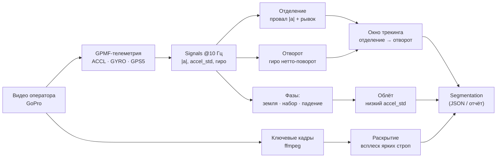
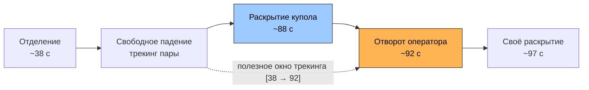
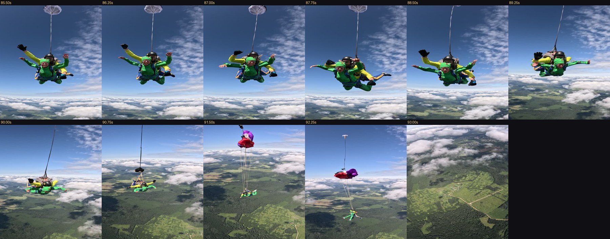
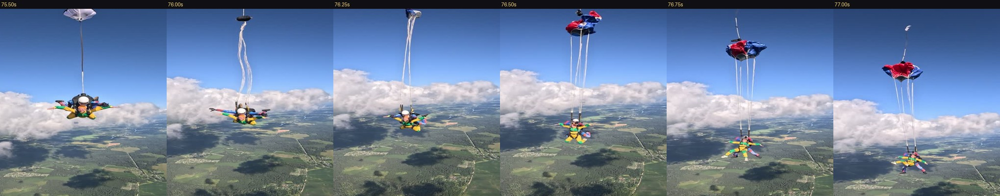
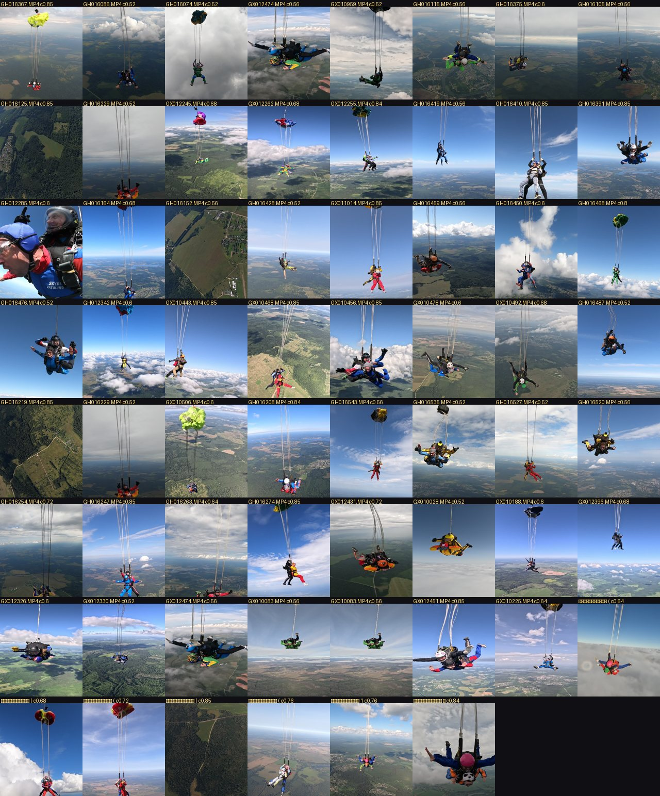

# tandem_detector

Автоматическая сегментация видеозаписей тандемных парашютных прыжков: система
находит границы типовых сцен по **телеметрии GoPro** и **видео**, и выдаёт
таймкоды (JSON) и наглядный HTML-отчёт. Монтаж в скоуп не входит — только разметка.

Цель — из «сырых» файлов камеры оператора автоматически выделить **полезный
фрагмент** (где оператор снимает тандемную пару) и разметить внутри него ключевые
фазы, чтобы дальше искать сцены/эмоции только там, где это имеет смысл.

---

## 1. Датасет

Записи снимаются **тремя разными камерами**, и это принципиально для детекции:

| Источник | Что это | Роль |
|---|---|---|
| **Камера оператора** (GoPro, файлы `GX*`, `GH*`) | Внешний видеооператор, снимающий пару в падении | **Цель детекторов** |
| **DJI-дрон** (`DJI_*`) | Съёмка с дрона, без GoPro-телеметрии | Отложено, вторая очередь |
| **Handcam** (папки `*хендикам*`) | Ручная камера | Отложено, вторая очередь |

Актуальные цифры по рабочему набору (только камера оператора):

- **266 видеофайлов** оператора в `Samples/` (DJI и handcam вынесены в `_dji/` и `_handcam/`);
- из них **96 — настоящие прыжки** (распознано свободное падение 32–80 с, медиана ~59 с);
- остальные файлы — интервью, борт, приземление и короткие сегменты (пишутся отдельными файлами).

Сырое видео в репозиторий **не попадает** (см. `.gitignore`) — только код, тесты и документация.

---

## 2. Архитектура пайплайна

Дорогой проход по видео (извлечение телеметрии и ключевых кадров) выполняется один
раз на файл; вся логика детекции работает поверх лёгких признаков и переизмеряется
за секунды — цикл разработки короткий.



Ключевые модули:

- `tandem/recon/gpmf.py`, `telemetry.py` — парсер GPMF (KLV) и извлечение потока телеметрии (`ffmpeg -codec copy`, без перекодирования).
- `tandem/phases/signals.py` — сборка сигналов: `|a|` (м/с²), `accel_std` (в g), оси акселерометра и **гироскоп** (рад/с), ресемпл на равномерную сетку 10 Гц.
- `tandem/phases/detect.py`, `api.py` — отделение, свободное падение, земля/набор.
- `tandem/phases/motion.py` — облёт (по `accel_std`) и **отворот оператора** (по гироскопу).
- `tandem/visual/deploy.py` — **раскрытие купола** (визуально, по стропам).
- `tandem/phases/segment.py` — сборка всего в единую `Segmentation` и окно трекинга.

---

## 3. Таймлайн прыжка и целевые фазы

Целевой выход — **три интервала на прыжке**, задаваемые тремя границами
(отделение, выход d-bag, отворот оператора):

- **отделение** = `[выход → бросок дрога]` (когда дрог распознан; иначе момент выхода);
- **свободное падение** = `[бросок дрога → выход d-bag]`;
- **раскрытие** = `[выход d-bag → отворот]`.

Свободное падение начинается **после броска дрога** (стабилизации пары под дрогом),
а не сразу после выхода. Бросок дрога — тандемное событие, на телеметрии оператора
его нет, поэтому ловится визуально по стабилизации (`detect_drogue`): пара перестаёт
кувыркаться и **висит под дрогом** — тонкая высокая вертикаль (near-full `vext`,
удержанная ≥1.5 с). Это зависит от ракурса (нужно, чтобы оператор снимал колонну
дрога снизу), поэтому детектор срабатывает не на всех прыжках; где сигнал не чист,
он **воздерживается** (отделение остаётся моментом, границу ставит человек) — честнее,
чем угадывать.

Все три интервала отдаёт `Segmentation.intervals()`. Землю/самолёт не выносим;
разбивка сцен внутри свободного падения (эмоции, общие планы, облёт) — бэклог.
Эти три границы ровно совпадают с моделью инструмента разметки
[`tandem_annotator`](../tandem_annotator) (`exit / deploy / breakoff`), чей
`tools/build_prefill.py` уже строит из `segment_file` черновик разметки.

Последовательность событий (пример GX012255, секунды от начала файла):



| Фаза | Признак | Источник |
|---|---|---|
| **Отделение** | Сглаженный провал `|a|` ниже ~0.7 g на ≥1 с + «рывок» (jerk) перед ним | Акселерометр |
| **Свободное падение** | Высокая болтанка / длительность до раскрытия-шока | Акселерометр |
| **Облёт пары** | Провал `accel_std` (плавный полёт вокруг пары) внутри падения | Акселерометр |
| **Отворот оператора** | Устойчивый **нетто-поворот** тела в конце падения | **Гироскоп** |
| **Раскрытие купола** | Последний **всплеск ярких строп** перед отворотом | **Видео** |

---

## 4. Выбранные модели (детекторы) и обоснование

Все детекторы — **эвристические, объяснимые** (без «чёрного ящика»): признак → порог,
откалиброванный по реальным прыжкам. Это осознанный выбор ради коротких итераций и
прозрачности; ML-«голова» для эмоций внутри окна трекинга — задача следующего этапа.

### 4.1. Отделение — акселерометр
Резкое изменение перегрузки: тело переходит от ~1 g к свободному падению. Ловим
**сглаженный провал** `|a|/G` ниже порога, удержанный ≥1 с, с проверкой «рывка»
(производной) перед провалом. Сглаживание критично: на реальном видео шумный провал
на входе в падение не даёт непрерывного под-порогового участка.

### 4.2. Отворот оператора — гироскоп (не акселерометр!)
Момент, когда оператор прекращает сопровождать пару и **отворачивается** — это конец
полезного трекинга. Ключевое решение: ловить его по **гироскопу**, а не по осям
акселерометра. Отворот — это **устойчивый поворот в одну сторону** (нетто-вращение),
тогда как болтанка падения знакопеременная (нетто ≈ 0). Берём знаковое скользящее
среднее по осям гиро и находим пик нетто-поворота в позднем окне (до собственного
раскрытия оператора). На эталонах попадание ±0–2 с.

### 4.3. Раскрытие купола — видео, «последний всплеск строп»
У раскрытого купола **нет сигнатуры на акселерометре оператора**, поэтому раскрытие
— строго визуально. Эволюция признака (по реальным кадрам):

1. ❌ *тёмный объект / вертикальная протяжённость* — неверно: стропы **яркие**, а раскрытый купол яркий/цветной, поэтому «тёмный» детектор уходил на пару, землю или собственный купол оператора.
2. ✅ *яркие тонкие вертикальные стропы* — считаем «колонки-стропы» (столбцы с ярким вертикальным гребнем). Всплеск = раскрытие.
3. ✅ *дрог ≠ основной купол* — **дрог** (вытяжной) присутствует весь фрифолл (серый купол, одна стропа); **основной** — последний всплеск строп **перед отворотом**. Берём **последний** всплеск в окне — так дрог (ранний) и шлем пары (мало строп) отсекаются.

Интервал **раскрытия = [выход d-bag → отворот оператора]** — от момента d-bag до
break-off (~4–5 с на практике). Это и есть правая граница `deploy → breakoff`,
которую потребляет инструмент разметки; прежний бракет [−1 с … +3 с] отменён.


*Дрог (серый, одна стропа) → выброс d-bag → основной купол с веером ярких строп.*


*Тот самый признак: чёрное пятно (d-bag) наверху и светлые стропы к паре.*

### 4.4. Облёт пары — акселерометр
Общий план сверху: оператор летит вокруг пары плавно, болтанка падает. Ловим
**провал `accel_std`** внутри установившегося падения.

### 4.5. Отделение по экспозиции — второй независимый сигнал
Выход из тёмного салона на дневной свет резко меняет экспозицию: **ISO** падает с
~500–1200 до ~100, **выдержка** ускоряется с ~1/220 до ~1/2000 (потоки `ISOE`/`SHUT`
в GPMF). `detect_exit_exposure` ловит переход в устойчивый дневной свет. Это
физически независимо от акселерометра (свет против перегрузки), поэтому служит
корроборатором отделения: на 96 прыжках акселерометр и экспозиция совпадают с
**медианой 1.1 с** (80% в пределах 3 с). Расхождение > 3 с помечается флагом
`EXIT_DISAGREEMENT` — приоритет на ручную проверку; такие прыжки коррелируют с
реальными сбоями детекции (напр. ложные раскрытия на «земле»).

---

### 4.6. Метаданные камеры — задел под сцены
GoPro HERO10/11 пишут в GPMF готовые метаданные, которые `build_signals`
агрегирует в признаки на сетке 10 Гц (проверено на реальных прыжках):

- **`FACE`** (14 байт на лицо: bbox + smile% + blink%) → `face_count`, `smile`, `blink`, `face_area`. Срабатывает там, где пара близко — **салон, отделение, под куполом** (в середине падения пара далеко), смайл 94–99% у борта. Готовый сигнал для **интервью** и **реакций пассажира**.
- **`AALP`** (уровень аудио, dBFS) → `audio_level`. Падает под куполом (ветер стихает).
- **`SCEN`** (классы сцены + вероятности) → `scene_indoor` (INDO): высок в салоне, **падает на отделении** — ещё один корроборатор выхода.

В фазовой сегментации эти признаки пока не используются — это фундамент под
детекторы сцен внутри окна трекинга (Слой 4 плана) и под разметку.

### 4.7. Единая таблица признаков (`tandem/features.py`)
`write_features_csv(sig, path)` выгружает все каналы `Signals` (accel/gyro/gps +
экспозиция + FACE/AALP/SCEN) в плоскую таблицу — одна строка на сэмпл 10 Гц. Один
дорогой проход по видео → таблица на прыжок; инструмент разметки и будущая модель
читают её вместо повторного парсинга GPMF, и эксперименты идут за секунды. Это
критерий готовности Этапа 0.

Регенерация — команда репозитория (запускать после любого изменения кода признаков):

```bash
python -m tandem.features Samples/ --out features/   # папка (рекурсивно) или один файл
```

Экспортирует по CSV на каждую запись с телеметрией (без GPMF — пропускает). Покрытие
на 96 прыжках: гироскоп/экспозиция/сцена 100 %, FACE 90 %, аудио 70 %, GPS-скорость 2 %.

## 5. Ключевые архитектурные решения

- **Телеметрия-first, GPS-высота не используется.** GPS-высота слишком шумная; фазы падения/снижения берём из акселерометра и 3D-скорости GPS.
- **Гироскоп для отворота, акселерометр для фаз.** Разные датчики под разные задачи: поворот тела чисто виден на гиро, перегрузка — на акселерометре.
- **Видео только там, где телеметрия слепа.** Раскрытие купола и уход пары из кадра — визуальные события; всё остальное — по телеметрии (дешевле и надёжнее).
- **Валидация на реальных прыжках, а не на синтетике.** Синтетические тесты + ревью пропускали баги (единицы `accel_std`, порог отделения, тайминг отворота), которые ловила только сверка с настоящими видео.
- **Развязка детекции от `accel_std`-гейта (важный фикс).** Отворот/трекинг/раскрытие раньше вызывались только если средний `accel_std` > порога. На части камер (файлы `GH*`) болтанка ниже порога — и гейт молча ронял детекцию на **большинстве** прыжков. Гироскопу `accel_std` не нужен; после развязки recall отворота вырос с 37 % до 90 %.
- **Два независимых сигнала на ключевые события + отказ от предсказания.** Отделение подтверждается акселерометром и экспозицией; расхождение не «усредняется», а поднимает флаг на ручную проверку. Это дешёвый контроль качества и генератор приоритетов для разметки — без единой метки.

---

## 6. Результаты (валидация на 96 реальных прыжках)

| Метрика | До развязки гейта | После |
|---|---|---|
| Отворот (гиро) распознан | 36/96 (37 %) | **87/96 (90 %)** |
| Раскрытие распознано | 24/96 (25 %) | **62/96 (64 %)** |
| Точность раскрытия (глазами) | — | **~90 %** |

Проверка всех 62 раскрытий по якорным кадрам: подавляющее большинство — купол + стропы;
ложные срабатывания (~3–5) на «земле» и крупном плане лица — известные режимы, кандидаты
на отсечку.


*Якорный кадр каждого распознанного раскрытия — визуальная проверка детектора на всём наборе.*

Тесты: `78 passed` (`pytest`). Визуальный детектор проверяется на реальных видео
(юнит-тесты не гоняются на кадрах — по правилу проекта: калибровка на настоящих прыжках).

---

## 7. Запуск

```bash
pip install -e .            # зависимости из pyproject.toml (нужен ffmpeg в PATH)
pytest -q                   # тесты
```

Сегментация одного файла:

```python
from tandem.phases.segment import segment_file
seg = segment_file("Samples/.../GX012255.MP4")
print(seg.to_dict())        # фазы, события, окно трекинга, раскрытие, облёт
```

---

## 8. Статус и дальнейшее

Работает: отделение, свободное падение, облёт, **отворот (гиро)**, **окно трекинга**,
**раскрытие (стропы)** — валидировано на 96 прыжках.

Дальше:
- разбивка сцен/эмоций **внутри окна трекинга** (ML-голова);
- отсечка ложных раскрытий (земля/лицо);
- 9 прыжков без отворота и ~34 без раскрытия — доразбор;
- вторая очередь: DJI-дрон и handcam.

## Документация

- [Дизайн системы](docs/superpowers/specs/2026-08-12-skydive-scene-detection-design.md) — исходная спецификация.
- [Исследование классификации сцен](docs/2026-08-19-scene-classification-research.md).
